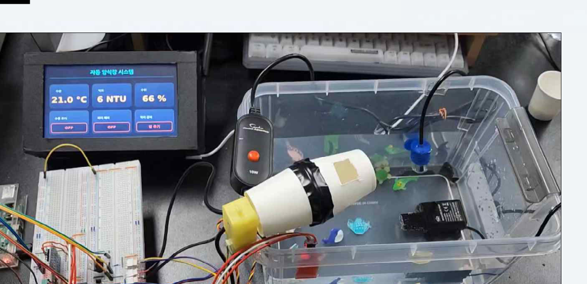
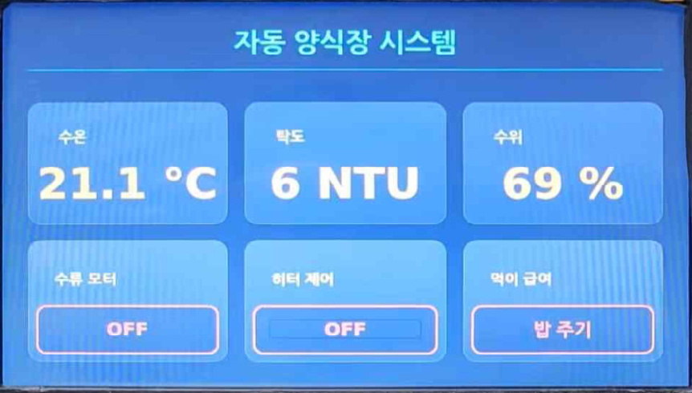
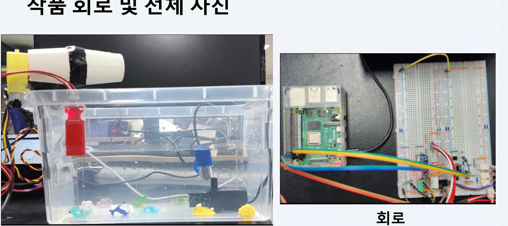
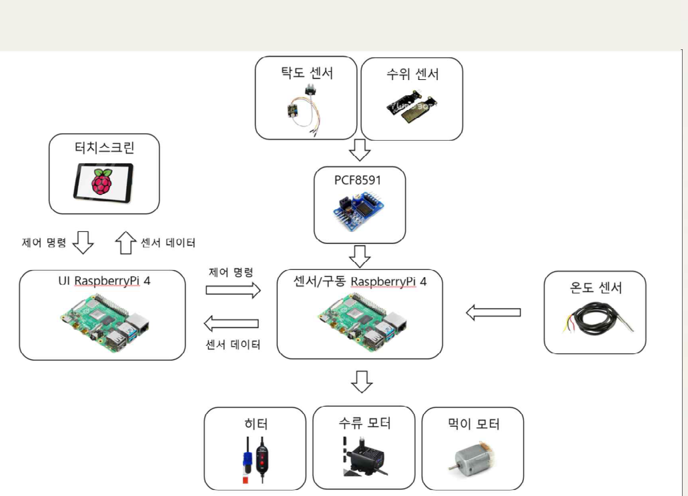
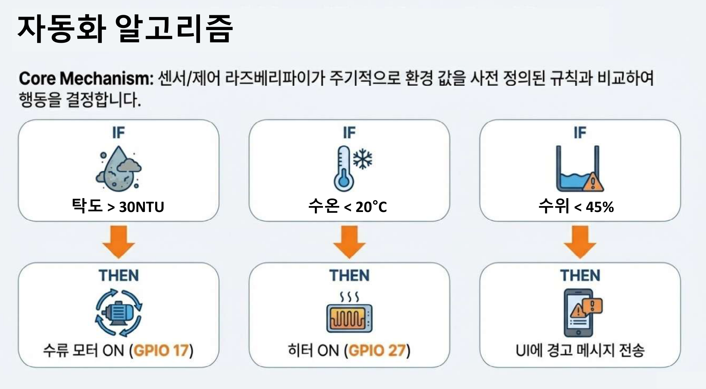

<div align="center">

# Yansikjang
### Smart aquaculture management system with a touch UI and dual-Raspberry Pi control

A compact embedded project that monitors tank conditions in real time and combines manual control with rule-based automation for small-scale aquaculture environments.



<br />


</div>

---

## Overview

`Yansikjang` is a compact smart aquaculture project built around two Raspberry Pi runtime roles. One device runs a full-screen PyQt5 dashboard for monitoring, manual input, and rule checks, while the other reads sensors and drives the actuators connected to the tank.

The project focuses on local embedded integration rather than cloud infrastructure. It combines a touchscreen UI, MQTT messaging, analog and digital sensors, GPIO-based actuator control, and UI-side automation in one small system that can be demonstrated on real hardware.

---

## Key Features

- Real-time monitoring for temperature, turbidity score, and water level
- Touch-friendly PyQt5 dashboard with a kiosk-style full-screen layout
- Manual device control for the water motor, heater, and feeder
- Rule-based automation for turbidity, temperature, and low-level alerts
- Split architecture that separates UI work from sensor and actuator control
- MQTT-based communication using `farm/sensors` and `farm/control`

---

## Gallery

<table>
  <tr>
    <td width="50%">
      
    </td>
    <td width="50%">
      
    </td>
  </tr>
</table>

<p align="center">
  <sub>The README uses presentation-derived images to show the touchscreen UI, the tank prototype, and the hardware setup together.</sub>
</p>

---

## System Architecture

<p align="center">
  
</p>

The repository is organized around two runtime roles:

- **UI Raspberry Pi**: runs the PyQt5 dashboard in `main.py`, visualizes incoming sensor values, evaluates the automation thresholds, and sends MQTT control commands from either the touchscreen or the rule checks.
- **MQTT bridge inside the UI process**: `mqtt_worker.py` runs in its own `QThread`, subscribes to sensor telemetry, forwards decoded JSON to the dashboard through a Qt signal, and publishes control commands generated by the UI.
- **Sensor / Control Raspberry Pi**: runs `rp2_client.py`, reads the sensors, drives the motor and heater outputs, handles feeder activation, and publishes telemetry back to the UI.

Communication between the two sides follows a simple MQTT publish/subscribe pattern:

- `farm/sensors` for sensor telemetry from the control side to the UI
- `farm/control` for command messages from the UI to the control side

---

## Communication Interface

The communication interface is intentionally small and uses one telemetry topic and one command topic over MQTT.

### 1) Telemetry path: control Raspberry Pi -> UI Raspberry Pi

- `rp2_client.py` reads the DS18B20 temperature sensor and the PCF8591 ADC channels for turbidity and water level.
- The control-side client packages the live values into JSON and publishes them to `farm/sensors` every two seconds.
- `mqtt_worker.py` subscribes to `farm/sensors`, decodes the JSON payload, and emits the result to the PyQt dashboard through `data_received`.
- `main.py` receives that dictionary in `update_sensors`, refreshes the cards, and immediately evaluates the automation rules.

Current telemetry payload shape:

```json
{
  "temp": 23.4,
  "turbidity": 41,
  "level": 62
}
```

### 2) Command path: UI Raspberry Pi -> control Raspberry Pi

- Touch actions in `main.py` publish commands for the water motor, heater, and feeder.
- The same command path is also reused by the automatic rule checks, so manual control and automatic control share one interface.
- `mqtt_worker.py` publishes those commands to `farm/control` as JSON.
- `rp2_client.py` subscribes to `farm/control`, parses the incoming message, and maps each command to GPIO output changes or to the feeder pulse routine.

Current command payload shape:

```json
{
  "device": "water_motor",
  "state": "ON"
}
```

Current command values emitted by the UI:

- `{"device": "water_motor", "state": "ON" | "OFF"}`
- `{"device": "heater", "state": "ON" | "OFF"}`
- `{"device": "feeder", "state": "ACTIVATE"}`

### 3) Runtime behavior notes

- The UI currently creates `MqttWorker(broker_ip="localhost")`, which means the dashboard expects the MQTT broker to be reachable on the UI host.
- The control-side client currently connects to `BROKER_IP = "192.168.0.202"`, so the two files assume that the broker is running on the UI-side Raspberry Pi at that address.
- Automatic control commands and manual commands use the same MQTT channel, which keeps the hardware-side interface simple and centralized.

---

## Hardware and Software Snapshot

| Category | Details |
|---|---|
| UI stack | `PyQt5`, `QTimer`, custom `stylesheet.qss` |
| MQTT client | `paho-mqtt` |
| Temperature sensor | `DS18B20` over 1-Wire |
| Analog sensors | Turbidity + water level through `PCF8591` ADC (`0x48`) |
| Actuator pins | Water motor `GPIO17`, feeder `GPIO22`, heater `GPIO27` |
| Runtime model | Local dual-device MQTT system |

The current repository styling in `stylesheet.qss` defines a dark navy dashboard with cyan highlights, card-style sensor panels, and clearly separated control buttons.

---

## Automation Logic

<p align="center">
  
</p>

The current automation behavior is evaluated in `main.py` after telemetry arrives from the sensor/control side:

- If the turbidity score is `>= 30`, the water motor is turned on.
- If temperature is `<= 20C`, the heater is turned on.
- If water level is `< 45%`, the UI shows a warning dialog.

The dashboard also starts a repeating feeder timer every five minutes through `QTimer`, while still exposing a separate manual feed button in the UI.

The control flow in `main.py` also keeps track of whether a device was enabled automatically, so the system only turns a device back off if the system turned it on in the first place. In practice, that means a manual ON state is not automatically turned back off by the UI unless the system itself enabled that device.

---

## Repository Structure

```text
yansikjang/
|- assets/
|  `- readme/
|     |- automation-logic.png
|     |- hardware-overview.png
|     |- hero-demo.png
|     |- system-architecture.png
|     `- ui-dashboard.png
|- main.py
|- mqtt_worker.py
|- rp2_client.py
|- stylesheet.qss
`- README.md
```

### File Roles

- `main.py` - PyQt5 dashboard, sensor rendering, manual controls, automation checks, and the repeating feeder timer
- `mqtt_worker.py` - MQTT thread for sensor subscriptions and control command publishing
- `rp2_client.py` - GPIO setup, sensor reads, actuator driving, and periodic telemetry publishing
- `stylesheet.qss` - dashboard look and feel, including cards, buttons, and popup styling

---

## Configuration Notes

This repository already shows the main runtime assumptions, but it is still a project archive rather than a polished deployment package.

- The UI side currently creates `MqttWorker(broker_ip="localhost")` in `main.py`.
- The control side currently targets `BROKER_IP = "192.168.0.202"` in `rp2_client.py`.
- In practice, the current code suggests the MQTT broker is expected to live on the UI host, so the broker address should be aligned before running the project across separate devices.

The code also labels turbidity as `NTU` in the UI, while `rp2_client.py` currently converts the raw ADC value into an inverted score-like value. The README keeps that distinction conservative and treats the UI label as a display choice rather than a calibrated scientific measurement.

---

## Project Context

This project was created as an embedded systems final project and works well as a portfolio piece because it shows the full path from hardware wiring to user-facing control software. It demonstrates how a small local system can combine sensing, messaging, automation, and interface design without depending on a larger cloud stack.

---

## Team Roles

This project was developed by two contributors with split responsibilities across the interface and control layers.

- **Park Gyuhyeon** - display implementation and sensor data collection
- **Lim Songju** - motor control implementation

The repository structure also lines up well with that division of work: the dashboard side centers on display and live monitoring, while the control-side logic concentrates on actuator handling.

---

## Authors

- Park Gyuhyeon - Electrical and Electronic Engineering, Dankook University
- Lim Songju - Electrical and Electronic Engineering, Dankook University
